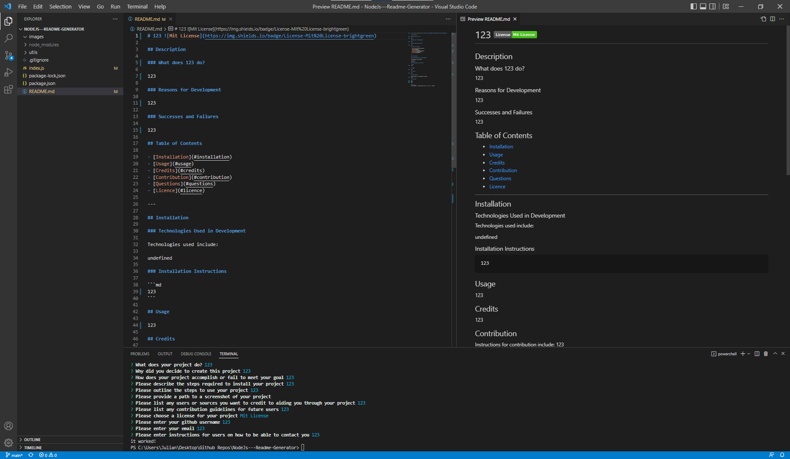

# Readme Generator 

## Description

### What does Readme Generator do?

This project prompts the user and generates a readme file based on the provided answers.


### Successes and Failures

This project is complete and meets all original goals.

## Table of Contents

- [Installation](#installation)
- [Usage](#usage)
- [Credits](#credits)
- [Contribution](#contribution)
- [Questions](#questions)
- [Licence](#licence)

---

## Installation 

### Technologies Used in Development

Technologies used include:

Nodejs, and the inquirer npm package

### Installation Instructions

```md
run npm install in the terminal
```

## Usage



```md
npm run start in the terminal
```

## Credits

Credits to myself and the inquirer documentation.

## Contribution

Guidelines for contribution:

Open to suggestions.

## Questions

Contact through email.

https://github.com/jq67
julianquanfun@gmail.com

---
## Licence
This project is covered under the `Mit License`