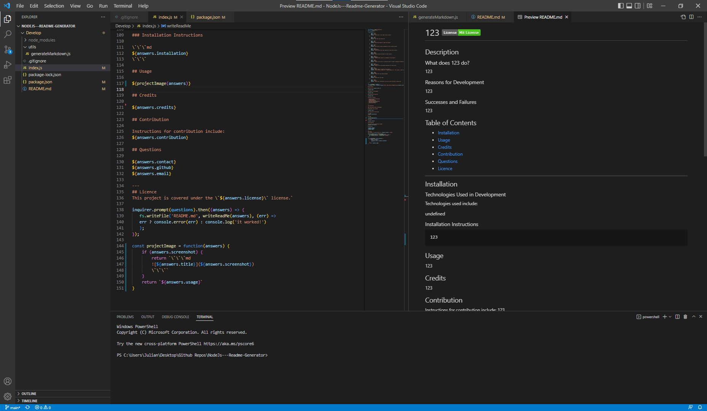

# 234 

## Description

### What does 234 do?

234

### Reasons for Development

234

### Successes and Failures

234

## Table of Contents

- [Installation](#installation)
- [Usage](#usage)
- [Credits](#credits)
- [Contribution](#contribution)
- [Questions](#questions)
- [Licence](#licence)

---

## Installation 

### Technologies Used in Development

Technologies used include:

undefined

### Installation Instructions

```md
234
```

## Usage

```md

```

## Credits

234

## Contribution

Instructions for contribution include:
234

## Questions

234
234
234

---
## Licence
This project is covered under the `Mit License` license.